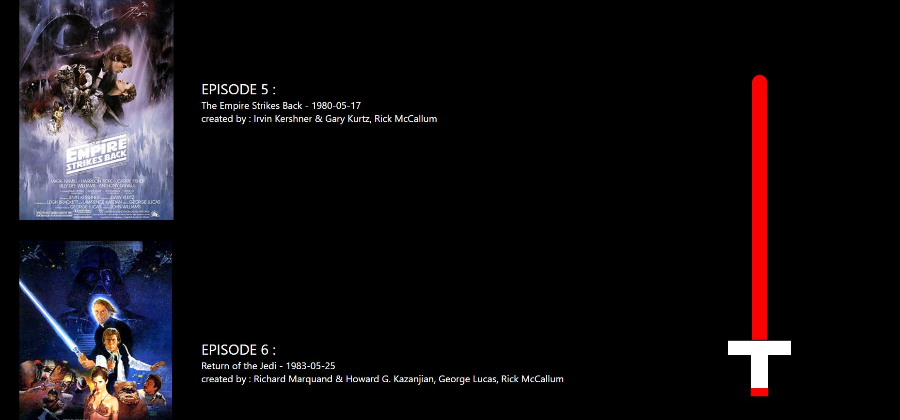

# Projet REACT ESI 4 avec Mounir BENDAHMANE

Création d'une application en React.
Utilisation de l'api 'https://swapi.dev/api/films'
Création d'un composant parent et enfant.

# REACT CSS

-inline :
style={{ color: 'white', padding: 15 }}
*Moins optimisé mais gain de temps*

-css/module:
import app  from './App.module.css';
className={app.movie}
*Les styles de votre composant ne s’appliqueront alors qu’à votre composant peu importe le nom de classe que vous utiliserez*

-css/feuille de style :
import './App.css';
className="movie"
*Suppression du code mort , plus performant perte de temps*

# Cours

composant -> vue peux la decomposer en composant

useeffect fct remplace componant di mount

react jsx-> js et typescript surcoucche

nb de composnant infini mais limite RAM

event listenern -> on passe le handler , on enleve parenthese pour mettre une reference (c'est une adresse)

usestate permet d'actualiser la vue en mettant a jour les variable

infinité de state mais si state compliqué utilisé [state, dispatch] = useReducer 

reducer prend fct et initial state

reducer fct pur en fonction des resultats 100% sur des resultats

